## Installera ESLint + Prettier

npm install -D eslint prettier

Sedan behöver vi konfigurera ESLint.

## Playwright

npm install -D @playwright/test

Sedan:
npx playwright install

## Vänta med Husky

-M1 kräver dessutom:
ESLint + Prettier körs i pre-commit via husky + lint-staged.

npm install -D husky lint-staged

## Kör bara detta Nu...

npm install -D eslint prettier @playwright/test
npx playwright install

# kör nu hela efter install alla som behöver

npm run lint
npm run format:check
npm run e2e:pw

npm install --save-dev globals

och skapa ny file eslint.config.js

## kör:

npm run test:run
npm run lint
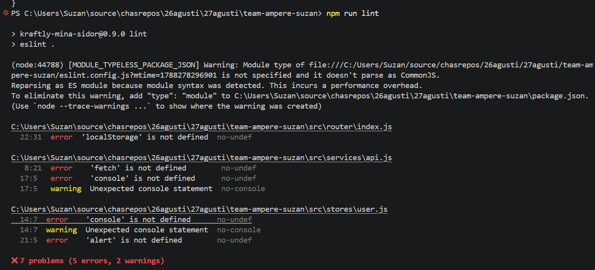
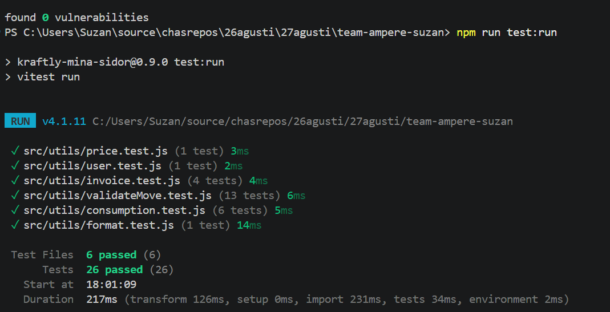
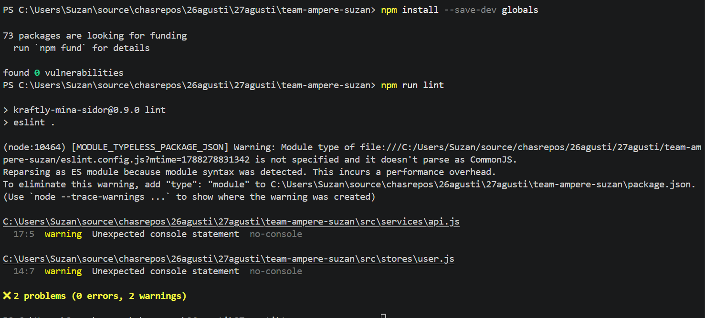

# efter skriva i package.json

"type": "module",

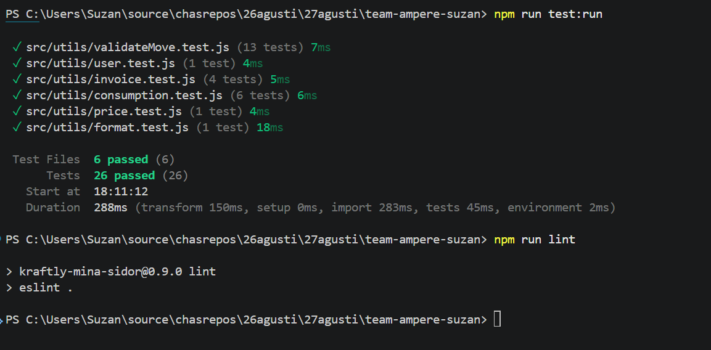

# efter kör format:check

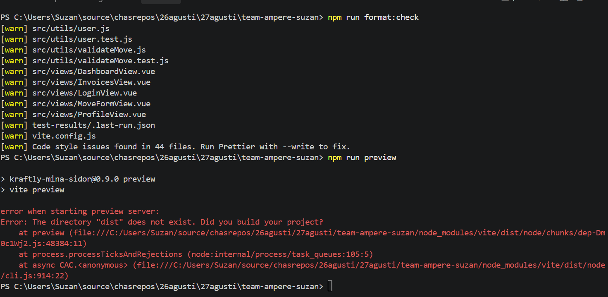

npx prettier --write .
npm run format:check

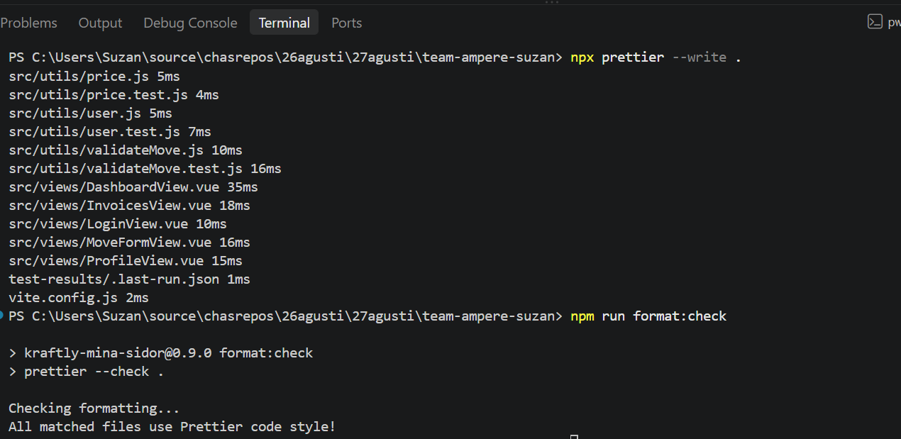

# kör:

npm run build
npm run preview

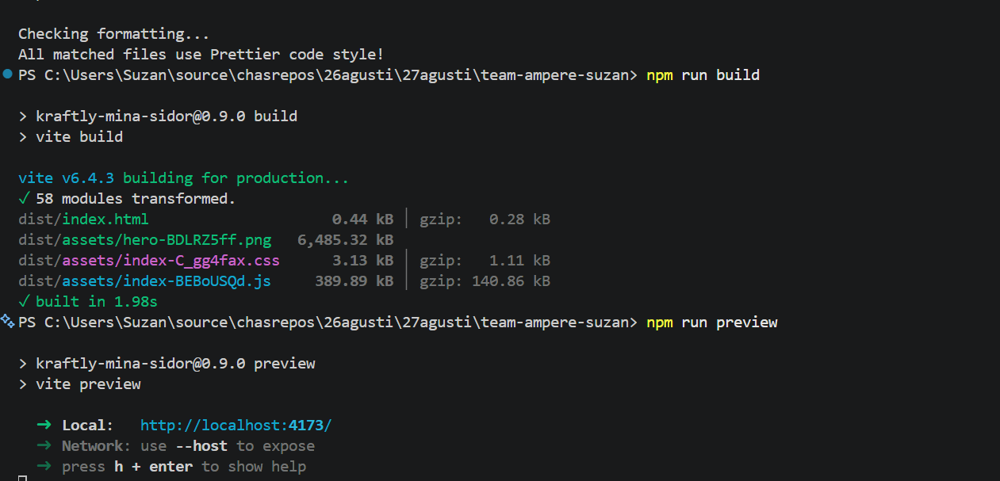

## efter kör med alla

npm run test:run
npm run lint
npm run format:check
npm run build
npm run e2e:pw

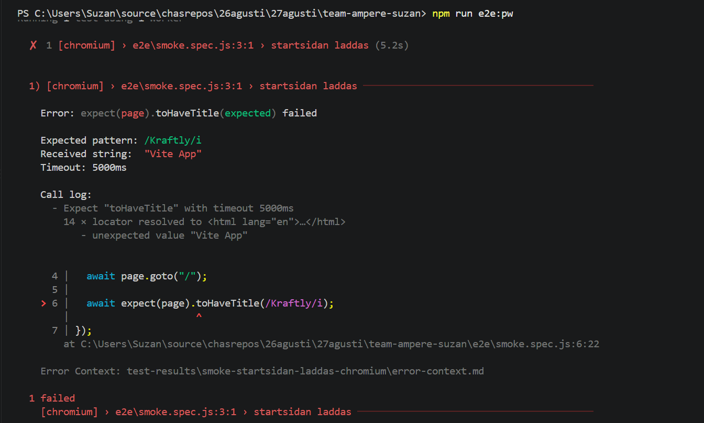

# lös med byta i samma title

i smoke.spec.js finns kraftly och i index.html finns Vite App så skriv <title>Kraftly - Mina sidor</title>
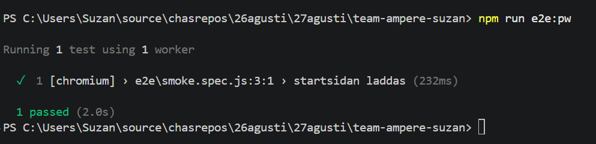

# Nu kör

Get-Content .husky\pre-commit

1. behöver install om cannot find path
   npm list husky lint-staged
   Du bör se båda paketen.

2. Skapa Husky
   npx husky init

Get-Content .husky\pre-commit
npx lint-staged 3. om tom skriv
Set-Content .husky\pre-commit "npx lint-staged"
npm install
git add src/utils/price.js
git status
git commit -m "chore: configure pre-commit"
-(dev branch not main)
git branch --show-current
git log --online -5

# kör

git status
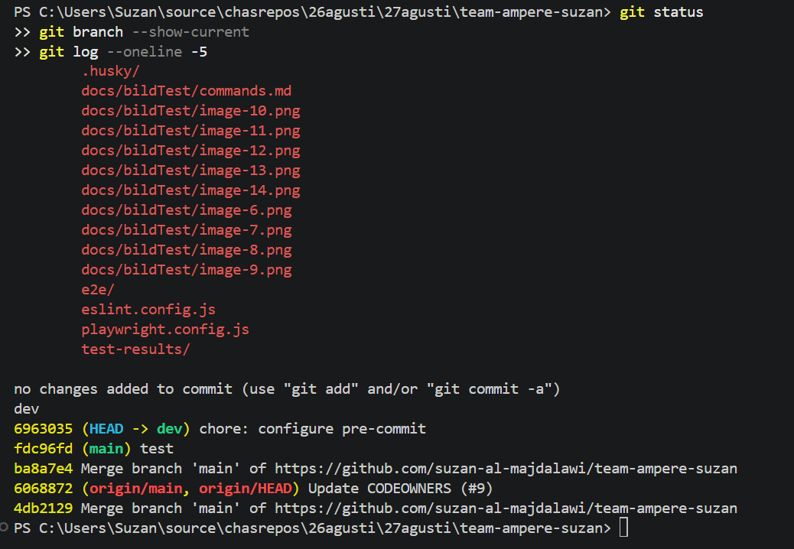

# Sista kör alla

npx prettier --write ".\test-results\.last-run.json"
npm run format
npm run format:check

npm run lint
npm run test:run
npm run e2e:pw

# efter ProfileView.spec.js

npm install -D @vue/test-utils
npx vitest run src/views/ProfileView.spec.js

## hitade Failed Test 4

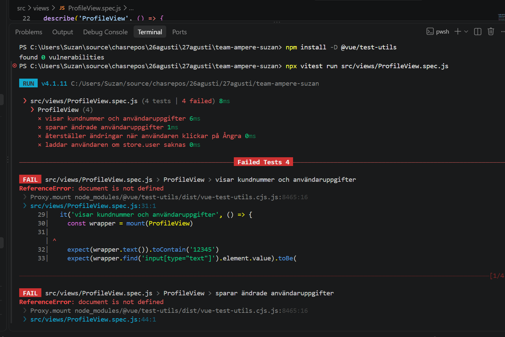
npm install -D jsdom
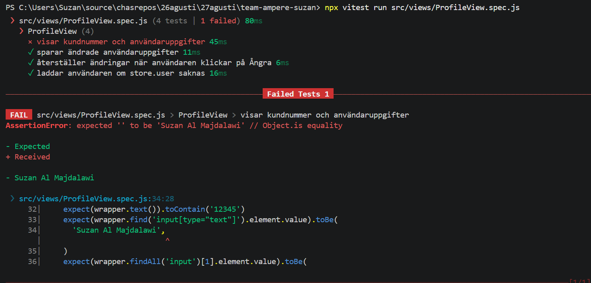
