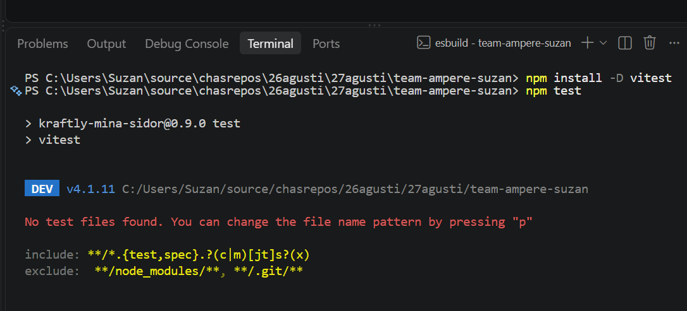
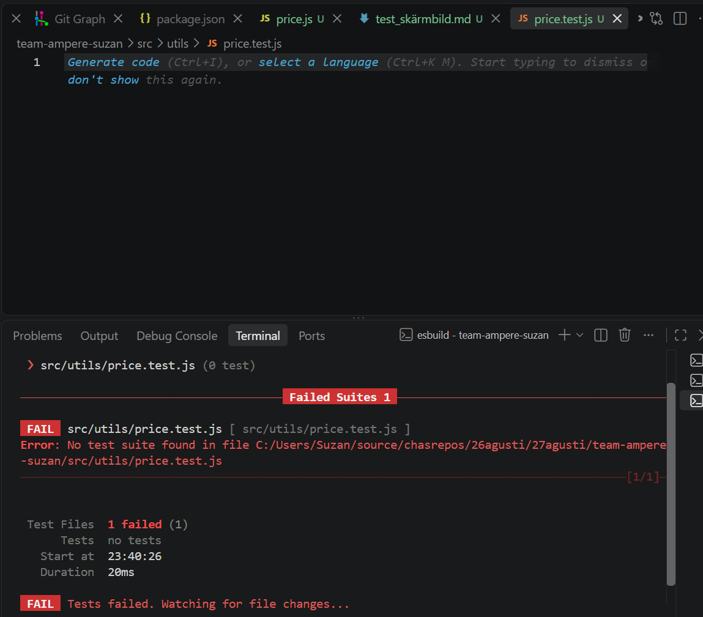
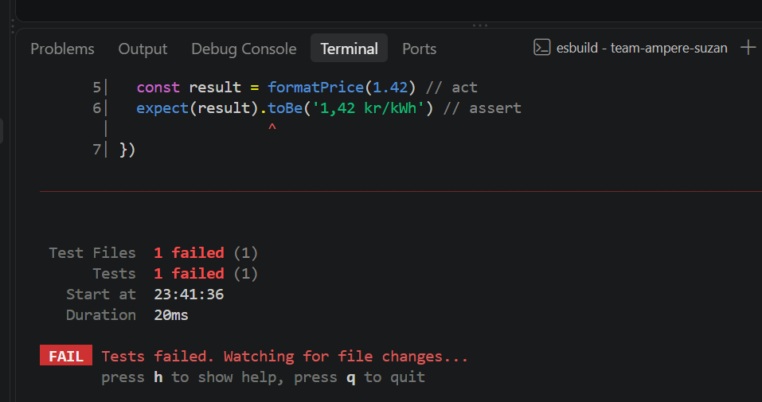
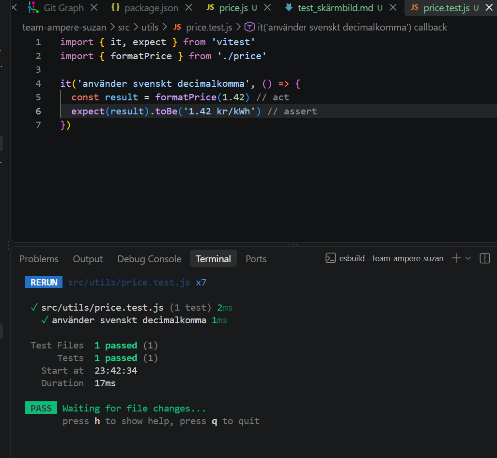
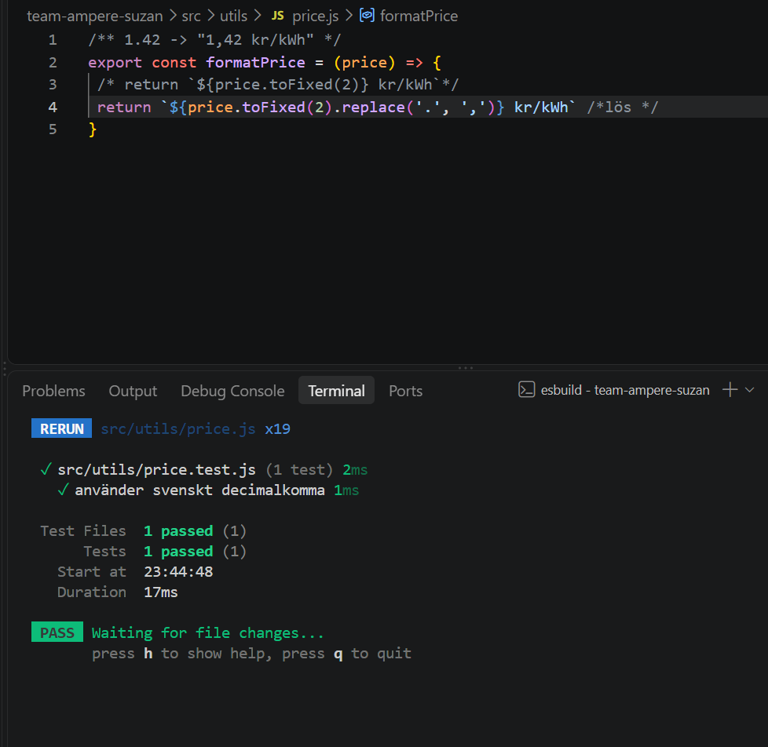
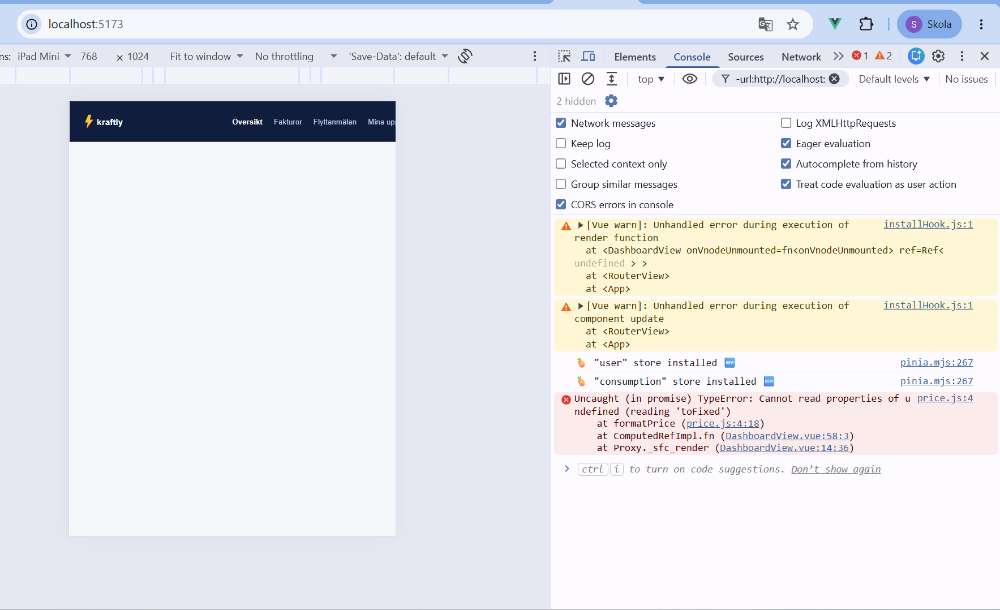

# Test 1 : Testet – rött, sen grönt

## finns problem efter byta i views/boardview  
´´´
6 · Koppla in i vyn
I DashboardView.vue:

import { formatPrice } from '../utils/price'

const currentPrice = computed(() => formatPrice(consumptionStore.data?.pricePerKwh))
Ta bort  kr/kWh ur templaten (rad 14) – enheten ligger nu i funktionen:

{{ currentPrice }}

Ladda om webbläsaren: 1,42 kr/kWh.

Om tiden räcker · TDD-smakprov
Testet först:

it('visar platshållare när priset saknas', () => {
  expect(formatPrice(undefined)).toBe('–')
})
Verifierat rött: TypeError: Cannot read properties of undefined (reading 'toFixed')

Sedan koden:

if (typeof price !== 'number' || Number.isNaN(price)) return '–'
→ 2 passed. Koppla till user.name.split()-kraschen ur deras skuldinventering: samma sorts bugg, nu fångad av ett test.

Verifierat i den här miljön
Node 22 · vitest 4.1.11
Steg 4 rött → grönt ✓
Steg 5 larm vid bruten kod ✓
TDD-steget rött → grönt (2 passed) ✓
npm run build går igenom ✓
Dashboarden renderar "1,42 kr/kWh" mot mock-API:et ✓
´´´
